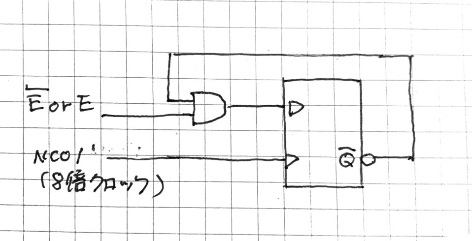
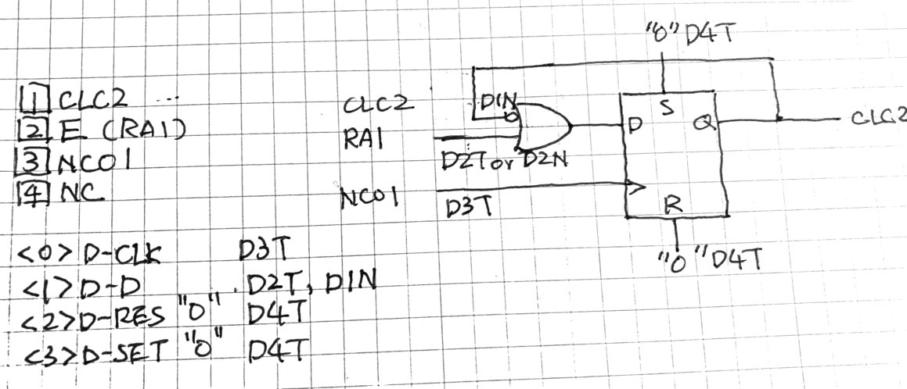
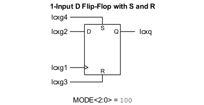

# MEZ6809/09E クロックストレッチ回路の設計

<figure>

</figure>

* 6809のEXTAL外部クロックに与えるクロックを伸ばす。
* 2分周フリップフロップを/QをD入力に与えるD-FFで構成する。
* E == H になると同時にD-FFのD入力をHに固定する。これでE,Qクロックが伸びる。
* この隙に内部処理を行う。内部メモリアクセスや、UART I/Oとか。
* 処理が終わると E == L でD-FFのD入力をHに固定するように更新する。CLCなら入力の極性反転で簡単に実現できる。
* 極性反転させると2分周クロック出力が再開される。そのうちにCPUはEクロックを落とす。すると E == Lになるので再度EXTALがHに固定され、E == L状態で伸びる。
* E == L状態で伸ばすのはデータバスの戻し(DDRCに0xffを代入する)ためで、戻しが完了すると再度CLC入力の極性反転する。今度はE == Hを待つようになり、次のメモリサイクルにつながる。

### CLCによる実現

* CLCにはD-FFがあるのでそれを用いる。
* D入力のORゲートを活用する。E or /E入力が"0"のときクロックが通過し、"1"のときCLC2OUTが常時"H"固定になる。
* クロック入力にゲートを掛けるとグリッジ(一瞬だけHになったりLになったり)が発生する個可能性があるので避けるべき。D入力をコントロールする場合、次のクロックの上りエッジまで出力は変わらない。クロック停止が同期的に行われる。

<figure>

<figcaption>CLC2にストレッチャを実現する</figcaption>
</figure>

* CLC2には最大4端子に入力を割り当てできる。ここでは、
  1. CLC2 ... 反転入力用に参照する。
  2. RA1 ... Eクロックを参照する。
  3. NCO1 ... 元クロック発振器からD-FFのCLK入力に割り当てる。
  4. NC ... 入力割り当てのない端子を作っておき、SET/RESET端子に与える"0"を作るネタとする。

```
    CLCnSEL0 = 0x34;    // g1 <- CLC2
    CLCnSEL1 = 0x01;    // g2 <- CLCIN1 <- RA1(E)
    CLCnSEL2 = 0x2a;    // g3 <- NCO1
    CLCnSEL3 = 127;     // g4 <- no connect
```
> CLCの8ユニット全体でGPIO(外部入力)8入力まで持てる。MEZ6809基板ではE端子はRA1につないであるので、この端子をCLCIN1に割り当てておく。

```
    CLCIN1PPS = 0x01;   // RA1 <- /MREQ <- E
```
* D-FFはいくつかあるが、ここでは 1-input SET/RESET D-FF(mode: 100)を選ぶ。

<figure>

</figure>

* 4入力に
  1. CLK
  2. D input
  3. SET
  4. RESET

  があり、それぞれに
  1. CLK <= NCO1
  2. D <= CLC2 | E or /E
  3. "0"
  4. "0"

* 入力に複数端子のOR入力ができる。ここではD入力で端子1,2をORして使う。

```
    CLCnGLS0 = 0x20;    // D-FF CLK <- D3T
    CLCnGLS1 = 0x09;    // D1N (temporary) 0x05;    // D-FF D   <- D1N && D2N
    CLCnGLS2 = 0x80;    // 0 for D-FF RESET
    CLCnGLS3 = 0x80;    // 0 for D-FF SET
```
レジスタ`CLCnGLS1`は、8bitを2bitずつ4フィールドに分割し、各フィールドが端子1-4に対応している。2ビットのうち下位がnegate(反転)で上位が非反転である。どちらか1ビットだけ立てて使うのが普通であり、両方立てると常時ONになる。

各入力の反転、出力の反転も可能だが、ここでは使っていない。`CLCnPOL`参照。

### 使い方

CLCnGLS1のビット2,3を10 or 01で用いる。Eの上りエッジ待ちでは10を設定し、下りエッジ待ちでは01を用いる。ということで、`CLCnGLS1 ^= 0x0c;`を用いて反転させている。

例によって`while(!RA1);`で上りエッジ待ち、E == H になるとアドレスデータを読み込み、メモリ配列から読み出し/への書き込みを実行し、E == Lを待つ。Lになるとデータバスを入力に切替`db_setin();`し、再度CLCnGLS1を反転させ、次のメモリアクセスを待つ。

```
    // sample loop for clock stretch
    while(1) {
        while(!RA1);    // wait for E upper edge
        TOGGLE;
        for (int i = 0; i < 3; ++i) {
            nop;    // dummy time eater
        }
        //
        CLCSELECT = 1;  // select CLC2
        CLCnGLS1 ^= 0x0c;   // toggle D2T,D2N
        TOGGLE;
        while(RA1);     // wait for E down edge
        TOGGLE;
        db_setin();
        CLCSELECT = 1;  // select CLC2
        CLCnGLS1 ^= 0x0c;   // toggle D2T,D2N
        TOGGLE;
    }
```
